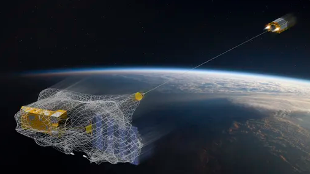

<!DOCTYPE html>
<html lang="pt-br">

<head>
    <meta name="viewport" content="width=device-width, initial-scale=1.0">
    <title>Lixo Espacial</title>
    <link rel="stylesheet" href="style.css">
</head>

<body>
    <header>
        
        <a href="#" class="logo">Save our Earth</a>
        <ul class="navigation">
            <li><a href="#banner">Home</a></li>
            <li><a href="#about">Sobre</a></li>
            <li><a href="#consequencias">Consequências</a></li>
            <li><a href="#fazer">O que fazer ?</a></li>
            <li><a href="#sustentabilidade">Sustentabilidade</a></li>            
        </ul>
    </header>
    <section class="banner" id="banner">
        

            <h2>Lixo espacial</h2>
            
Chegou o momento de começar a cuidar do cosmo?

            <li><a href="#about" class="btn">Saiba mais</a></li>
        

    </section>
    <section class="about" id="about">
        

            

                
                <h2 class="titleText">
                    Inovações Tecnológicas
                </h2>
                
Desde o primeiro objeto lançado no espaço, o satélite Sputnik, as inovações tecnológicas vêm se aprimorando quase que diariamente, com estudos relacionados às condições climáticas, navegadores GPS, sinal digital para TV, telefonia, etc.Toda essa tecnologia é graças à persistência do homem pela busca do conhecimento. 
                    De fato, podemos dizer que a tecnologia tem sido bem recebida pela sociedade, mas o que não podemos esquecer é que sempre atrás da busca pelo conhecimento há uma série de consequências. 
                    É graças aos satélites lançados no espaço que colhemos os frutos de uma boa comunicação via celular, uma excelente imagem nos canais de TV, uso do GPS, etc. 
                    Uma das consequências que tem causado preocupação para os cientistas é em relação ao lixo espacial.
                

            

            

                

                    
                

            

        
        
    </section>
    <section class="about" id="about">
        

            

                
                <h2 class="titleText">
                    Lixo Espacial
                </h2>
                
Toneladas de foguetes, naves e satélites foram lançados no espaço desde 1957, início da era espacial, no entanto, ninguém foi capaz de prever o que fazer com eles no final de sua vida útil.  
                   A Agência Espacial Europeia (ESA) estima que existem cerca de 900.000 objetos com dimensões superiores a um centímetro sem qualquer utilidade em órbita ao redor da Terra.  
                   Segundo a ONU, tal fato coloca em perigo futuras missões e, inclusive, as comunicações terrestres.
                

            

            

                

                    
                

            

        
        
    </section>
    <section class="about" id="about">
        

            

                
                <h2 class="titleText">
                    O que é Lixo Espacial?
                </h2>
                
O lixo espacial engloba qualquer peça ou resto deixado pelo ser humano no espaço e cuja origem, portanto, está na Terra. 
                    Esses resíduos espaciais podem ser tão grandes quanto um satélite inativo, similar ao tamanho de um carro, ou tão pequeno quanto uma casca de pintura que se desfaz. 
                    O verdadeiro perigo é a velocidade em que esses objetos se movem, mais de 28.000 quilômetros/hora, o que os converte em autênticos projéteis. 
                    Em 1957, após o início da corrida espacial, o Comando de Defesa Aereoespacial da América do Norte (NORAD) começou a compilar um banco de dados com todos os resíduos. Atualmente, segundo a Agência Espacial Europeia (ESA), existe aproximadamente 900.000 objetos cujo tamanho se situa entre 1 e 10 cm e cerca de 34.000 superiores a 10 cm. 
                

            

            

                

                    
                

            

        
        
    </section>
    <section class="about" id="about">
            

                
                <h2 class="titleText">
                    Tipos de Lixo Espacial
                </h2>
                
De acordo com a ESA, os resíduos espaciais incluem: 
                    1- <strong>Carga útil:</strong> refere-se, principalmente, a satélites. Inclui os fragmentos como resultado da deterioração ou de colisões. 
                    2- <strong>Foguetes:</strong> restos dos estágios utilizados para colocar missões em órbita. Também inclui os fragmentos como resultado da deterioração ou de colisões. 
                    3- <strong>Objetos relacionados às missões:</strong> por exemplo, ferramentas perdidas como parafusos, cabos, câmeras, etc.  
                    Devido ao seu tamanho, os resíduos espaciais são classificados da seguinte forma:  
                    1- <strong>Menos de 1 cm:</strong> estima-se que existem mais de 128 milhões desses fragmentos e, em sua maioria, são indetectáveis. 
                    2- <strong>Entre 1 e 10 cm:</strong>  calcula-se que existem cerca de 900.000 em órbita e seu tamanho varia de uma bola de gude ao de uma bola de tênis. 
                    3- <strong>Mais de 10 cm:</strong>estes objetos incluem desde ferramentas perdidas em missões até satélites fora de serviço.  
                

                

                    

                       

                    

            
           
    </section>
    
    <section class="about" id="about">
        

            

                
                <h2 class="titleText">
                    Consequências
                </h2>
                
Uma vez que dois satélites desativados se choquem, milhões de partículas são liberadas, e isso pode causar danos a um satélite em funcionamento, por exemplo. Com isso, os serviços de GPS, telefones móveis e transmissões de emissoras de televisão, por exemplo, seriam interrompidos. 
                    Ainda nessa perspectiva, equipamentos lançados ao espaço sofreriam danos, que poderiam parar de funcionar. Consequentemente, mais lixo seria produzido. 
                    Por fim, o lixo espacial também oferece riscos à vida do astronauta, haja vista a quantidade de destroços na órbita terrestre. 
                

            

            

                

                    
                

            

        
        
    </section>
    
    <section class="about" id="about">
        

            

                
                <h2 class="titleText">
                    O que Fazer?
                </h2>
                
Há alguns estudos em curso no que se refere ao descarte de lixo espacial. 
                    Uma das sugestões consiste em um instrumento para capturar os resíduos e trazê-los à atmosfera. Dessa forma, a desintegração seria feita. Entretanto, para que esses estudos sejam concretizados e posteriormente colocados em prática, há que se ter recursos para extrair tal lixo. 
                    Vale mencionar que não basta apenas retirar o lixo, mas também programar os equipamentos para que não fiquem à deriva no espaço. 
                

            

            

                

                    
                

            

        
        
    </section>
    
    <section class="about" id="about">
                

            

                
                <h2 class="titleText">
                    Sustentabilidade
                </h2>
                
A preocupação com a exploração do espaço tem crescido cada vez mais. Considerando a quantidade de satélites e robôs lançados na atmosfera, questões relacionadas com o meio ambiente têm crescido cada vez mais, sobretudo aqueles que tem investido. 
                    Sustentabilidade refere-se ao princípio da busca pelo equilíbrio entre a disponibilidade dos recursos naturais e a exploração deles por parte da sociedade. Ou seja, visa a equilibrar a preservação do meio ambiente e o que ele pode oferecer em consonância com a qualidade de vida da população. 
                    O termo sustentabilidade surge da necessidade de discussão a respeito da forma como a sociedade vem explorando e usando os recursos naturais, pensando em alternativas de preservá-lo, porém não se aplica apenas na preservação dentro da terra, mas tambem ao redor dela 
                

            

            

                

                    
                

            

        
        
    </section>
        
 
 <a href="#" class="btn">Inicio</a>

</section>
<section class="about" id="about">

    <h2 class="titleText">Save Our Earth</h2>

</section>

    
</body>

</html>
